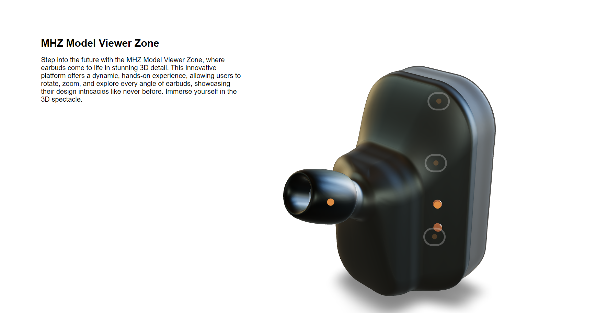
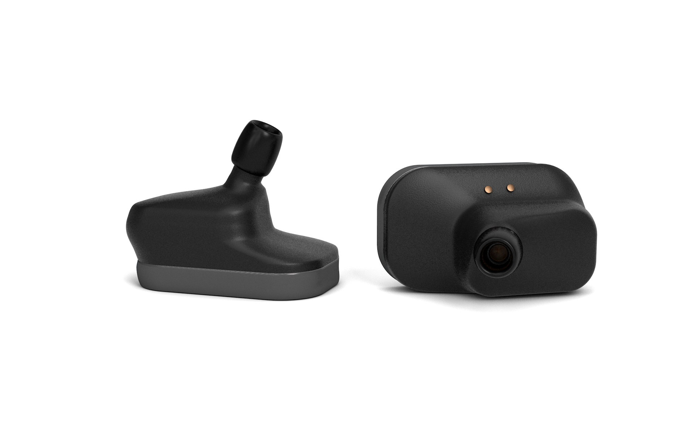
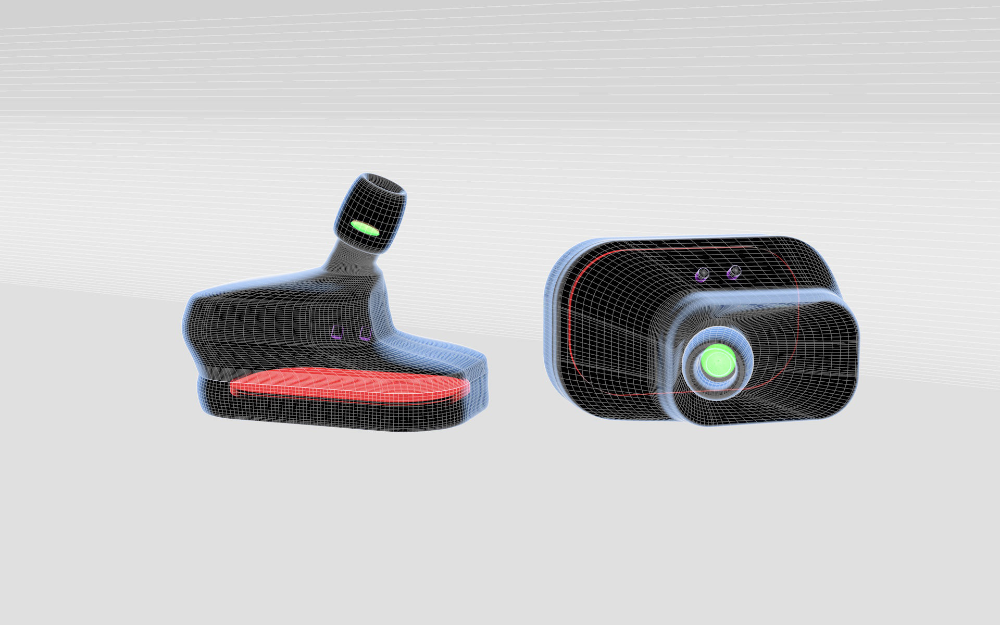
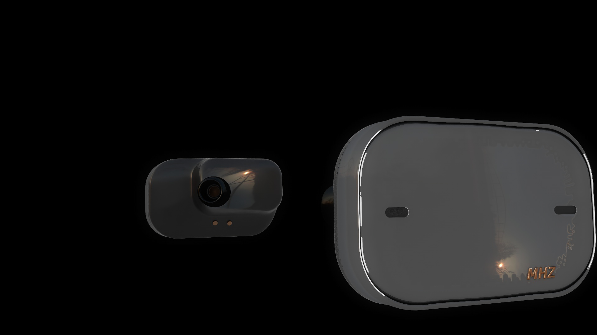

### Zarandah_Mohamed_Earbud

 

# Earbud Responsive Site
 Product site showcasing MHZ&trade; earbuds with its usability of an Xray function, stacking on a modelviewer of a 3d render and inputing features of a scrolling animation.

 

## Usage

1. **Explore Features:**
    
   - Dive into the key features section to understand the capabilities of MHZ™ Earbuds.

2. **3D Model Viewer:**
    
   - Use the interactive 3D model viewer to inspect every angle of the earbuds. Rotate, zoom, and explore the sleek design.

3. **Xray Functionality:**
    
    
   - Unlock the inner workings with the Xray function. Discover the advanced technology that sets MHZ™ Earbuds apart.

4. **Scrolling Animation:**
    
   - Engage with the scrolling animation to seamlessly unveil the various features. Swipe through to learn about noise cancellation, touch-sensitive controls, and more.

## Join the Revolution

Don't just listen; immerse yourself in the future of audio technology. Follow us on [Instagram], [Twitter], and [Facebook] for updates.

---

**[Shop Now]:** [Link to your online store]
**[Instagram]:** [Link to Instagram]
**[Twitter]:** [Link to Twitter]
**[Facebook]:** [Link to Facebook]

 

### Team Members:

Mohamed H Zarandah: 
    
    
    {Roles: "Product Design | Web Design/Development | Content Management | Editor",

    Description: "Moh is an imaginative individual with a passion for creativity. During his early education, he dedicated his time to design and visual arts, fostering a deep appreciation for Visual Media and Communications. Now a Student of Interactive Media Design at Fanshawe College, Mohamed is the Creative Director / Team Leader / CEO of MHZ", },

 

 

## Contributing
* Photoshop
* Cinema4d
* Illustrator
* After Effects
* Visual Studio Code
* GitHub

## History
main
1. dev.mhz.start by Mohamed
2. dev.mhz.phone by Mohamed
3. dev.mhz.final by Mohamed

## Credits

Mohamed Zarandah #1005140
 

## License
MIT